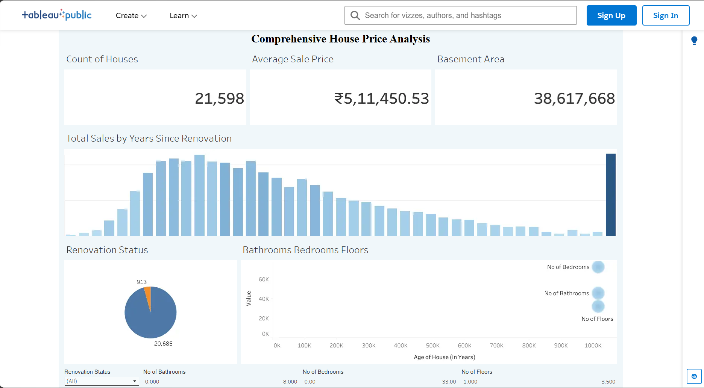

# Project Results

## Live dashboard

[Comprehensive House Price Analysis — Tableau Public](https://public.tableau.com/app/profile/venkata.venkamsetty/viz/ComprehensiveHousePriceAnalysis/ComprehensiveHousePriceAnalysis?publish=yes)

## Local Flask application

Start the application from the project root:

```powershell
python app.py
```

Then open [http://127.0.0.1:5000/](http://127.0.0.1:5000/) in a browser.

## Dashboard screenshot



The screenshot above shows the published Tableau dashboard, including the headline KPIs, total sales by years since renovation, renovation status, and housing-feature analysis.
